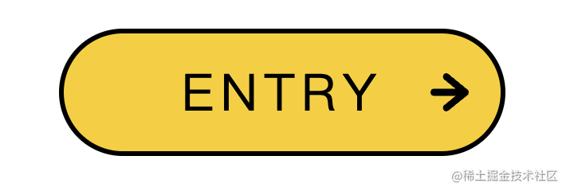

# CSS 的快乐：画一个可爱的三只小鸟 Button

[mp.weixin.qq.com](http://mp.weixin.qq.com/s?__biz=Mzg2MDU4MzU3Nw==&mid=2247494280&idx=1&sn=1d78a95e3d24142d424d952b9b02ce41&chksm=ce26897ef9510068e61c959993a294161a3f1a270ee9bbcb047b2b30e83d4c8eeffb126cfcb8&mpshare=1&scene=1&srcid=12065qtYKim29smsvUUSo2xa&sharer_sharetime=1670256764634&sharer_shareid=b8d5da03cbe546fb54510ac993e581cf#rd)神说要有光zxg iCSS前端趣闻

做为前端工程师，最大的快乐之一就是可以用 CSS 画出各种有趣的效果。

比如我最近画的一个 Button：

画的过程中确实很开心，这也是我当时选择做前端的很大一部分原因。

今天我们就一起来画下这个可爱的 Button 吧！纯 CSS，没用到图片和 JS 呦～

首先我们需要一些前置知识：

## border-radius

border-radius 大家用的比较多了。

比如一个这样的 div：

`#box{-
width:100px;-
height:100px;-
background:#f4cf47;-
border:solid3px#000;-
}-
`

可以分别设置四个圆角的半径：

`#box{-
border-radius:20px30px40px50px;-
}-
`

从效果上也可以看出来分别是左上、右上、左下、右下的圆角。

其实还可以设置椭圆角，椭圆和圆的区别是圆的半径都是一样的，而椭圆则是有长轴和短轴，可以不一样。

可以分别设置长半轴和短半轴的长度，用 / 隔开：

`#box{-
border-radius:20px30px40px50px/20px30px40px50px;-
}-
`

当然，上面这个长短半轴相等了，也就是圆角了。

比如这样设置：

`#box{-
border-radius:20px30px40px50px/50px40px30px20px;-
}-
`

效果是这样的：

分开看每个角：

左上角的横半轴是 20px，竖半轴是 50px，所以是这样的：

左下角横半轴是 40px，竖半轴是 30px，所以是这样的：

通过调整四个角的横竖半轴长度，就可以实现很多形状。

比如三只小鸟的睡觉时的形状：

或者醒的时候的形状：

还有鸟嘴和眼睛的形状：

当然，圆角能画的形状终究还是受限制的，更复杂的形状需要用别的方式来画，比如 clip-path：

## clip-path

前面说过，整个按钮都没有用到图片，那按钮的这个背景：

还有这几根鸟毛：

怎么画呢？

border-radius？

border-radius 再怎么调也只是各种椭圆，没法画这种复杂形状。

想实现这些没有规律的复杂形状就要用到 cli-path 了。

比如这样一个 div：

`#box{-
width:130px;-
height:38px;-
background:blue;-
}-
`

加上这样一个 clip-path:

`#box{-
clip-path:path('M13.77,37.35L.25,16.6c-.87-1.33,.69-2.91,2-2.02l12.67,8.59c.81,.55,1.91,.14,2.18-.81l2.62-9.33c.39-1.4,2.34-1.42,2.76-.02l3.6,11.99c.33,1.11,1.74,1.4,2.47,.52L49.38,.52c.87-1.04,2.53-.42,2.53,.95V23.7c0,1.13,1.2,1.83,2.16,1.26l12.75-7.51c.85-.5,1.94,0,2.13,.98l1.5,7.6c.2,1.03,1.37,1.51,2.22,.92l17.74-12.3c1.09-.75,2.52,.25,2.21,1.55l-2.44,10.2c-.26,1.09,.74,2.06,1.8,1.75l30.8-9.04c1.37-.4,2.42,1.26,1.49,2.36l-9.07,10.66c-.83,.98-.1,2.49,1.17,2.42l12.12-.68c1.6-.09,2.12,2.15,.65,2.8l-2.73,1.21c-.18,.08-.38,.12-.58,.12H14.97c-.48,0-.93-.25-1.2-.65Z');-
}-
`

就会变成这种形状：

或者这样一个 div：

`#box{-
width:12px;-
height:12px;-
background:#000;-
}-
`

加上这样的 clip-path：

`#box{-
clip-path:path('M10.23,3.32c-3.54,.63-5.72,2.51-7.02,4.23-.33-1.58-.34-3.54,.93-5.12,.52-.65,.41-1.59-.24-2.11C3.24-.19,2.29-.08,1.77,.57c-3.82,4.77-.31,11.11-.13,11.42,0,0,0,0,0,0,0,0,0,0,0,0,0,0,0,0,0,0-.01-.02,2.49,.04,2.52,0,.1-.14,1.54-4.82,6.59-5.71,.82-.14,1.37-.92,1.22-1.74s-.94-1.36-1.75-1.21Z');

}

`

就会变成这种形状：

背景和鸟毛不就出来了么～

这个样式还是很容易理解的，就像剪纸一样，把一块区域按照某个路径进行裁剪（svg 中也有这个）。

当然，不只可以写 path，还支持别的形状：

`clip-path:circle(40%);-
clip-path:ellipse(130px140pxat10%20%);-
clip-path:polygon(50%0,100%50%,50%100%,050%);-
clip-path:path('M0200L0,75A5,50,0,1150,75L200200z');-
`

但是，这个形状怎么来呢？

手写么？

这肯定不靠谱。

其实是可以用 illustrator 等矢量图设计软件来画，导出为 svg 的。

比如 illustrator，用钢笔在左上角画一个形状：

选中它，然后点击“对象 > 复合路径 > 建立”：

再点击导出，这时候导出的就是带 path 的 svg。

有两点需要注意：

*   要从左上角开始画，因为 svg 里第一步是先做位移。
    
*   没有复合路径那一步，导出的可能是 polygon、circle 这种形状，而不是 path
    

把路径复制到 cli-path 的样式处，就可以看到裁切后的效果了：

这样，涉及到的各种形状我们就都能画了。

再看一眼这个 Button：

是不是就有思路了呢～

接下来我们动手画一下吧。

## 画 Button

先写出 html 的结构：

`<ahref="#"class="buttonbutton--bird">-
<divclass="button__wrapper">-
<spanclass="button__text">ENTRY-

-
</a>-
`

比一般的 button 多了一级，这是因为我们要通过每一级的 ::before 和 ::after 加一些伪元素。

设置 .button 的样式：

`.button{-
display:flex;-
justify-content:center;-
align-items:center;

box-sizing:border-box;-
width:280px;-
height:80px;

text-decoration:none;-
border:solid3px#000;-
border-radius:40px;-
background:#f4cf47;-
}

`

通过 flex 布局，让子元素居中。设置 width、height，背景颜色、圆角等。

现在效果是这样的：

其中的背景颜色可能会变，更好的方式是抽出一个变量来维护：

`.button--bird{-
--main_color:#f4cf47;-
}-
.button{-
background:var(--main_color);-
}-
`

然后设置子元素的样式，也就是 .button\_\_warpper：

`.button__wrapper{-
display:flex;-
justify-content:center;-
align-items:center;

width:100%;-
height:100%;-
}

`

它同样要设置子元素居中，然后宽高都是 100%。

它的子元素就是 span 文本标签了，也就是 .button\_\_text：

`.button--bird{-
--base_color:#000;-
}-
.button__text{-
font-size:32px;-
letter-spacing:4px;-
color:var(--base_color);-
}-
`

指定字体大小、文字间距和颜色。颜色是可能会变的，所以也抽成变量。

现在的效果是这样的：

然后我们加上一些伪元素做装饰：

先给最外层元素加：

`.button::before{-
content:'';

position:absolute;-
right:20px;

margin:auto0;-
width:24px;-
height:24px;

background:var(--base_color);-
clip-path:path('M24,12.02c0-1.09-.75-1.71-.81-1.77L11.17,.45c-.91-.74-2.21-.56-2.91,.42-.69,.97-.52,2.37,.39,3.11l7.12,5.81-13.7-.02h0C.93,9.77,0,10.76,0,11.99c0,1.23,.93,2.22,2.07,2.22l13.7,.02-7.13,5.78c-.91,.74-1.09,2.13-.4,3.11,.41,.58,1.03,.88,1.65,.88,.44,0,.88-.15,1.25-.45l12.04-9.76c.07-.06,.82-.67,.82-1.77Z');-
}

`

伪元素用了绝对定位，那元素就要相对定位：

`.button{-
position:relative;-
}-
`

也就是让伪元素相对它来偏移。

指定宽高和位置，还有背景颜色，再就是裁切的形状（这里用 clip-path 裁剪的是一个箭头的形状）

效果就是这样的：

然后再往里一层，给 .button\_\_wrapper 加 ::before 和 ::after 伪元素：

`.button--bird{-
--sub_color1:#f4e19c;-
}-
.button--bird.button__wrapper::before,-
.button--bird.button__wrapper::after{-
content:'';

position:absolute;-
bottom:0;

width:130px;-
height:38px;

background:var(--sub_color1);

clip-path:path('M13.77,37.35L.25,16.6c-.87-1.33,.69-2.91,2-2.02l12.67,8.59c.81,.55,1.91,.14,2.18-.81l2.62-9.33c.39-1.4,2.34-1.42,2.76-.02l3.6,11.99c.33,1.11,1.74,1.4,2.47,.52L49.38,.52c.87-1.04,2.53-.42,2.53,.95V23.7c0,1.13,1.2,1.83,2.16,1.26l12.75-7.51c.85-.5,1.94,0,2.13,.98l1.5,7.6c.2,1.03,1.37,1.51,2.22,.92l17.74-12.3c1.09-.75,2.52,.25,2.21,1.55l-2.44,10.2c-.26,1.09,.74,2.06,1.8,1.75l30.8-9.04c1.37-.4,2.42,1.26,1.49,2.36l-9.07,10.66c-.83,.98-.1,2.49,1.17,2.42l12.12-.68c1.6-.09,2.12,2.15,.65,2.8l-2.73,1.21c-.18,.08-.38,.12-.58,.12H14.97c-.48,0-.93-.25-1.2-.65Z');-
}

.button--bird.button__wrapper::before{-
left:0;-
}-
.button--bird.button__wrapper::after{-
right:0;-
transform:rotateY(180deg);-
}

`

分别在前后加上一个伪元素，设置宽高和背景色，裁切的形状。然后分别设置不同的位移，右边要反过来，所以是 rotateY(180deg)。

背景色也可能变，所以抽出一个变量。

这里伪元素用到了 position：absolute，同样要在元素上加上 position: relative;

`.button__wrapper{-
position:relative;-
}-
`

效果就是这样的：

然后我们先加一些 hover 的效果吧，毕竟也算一个完整的 Button 了。

hover 的时候，让字体间距变大，两个草丛背景分别左右移动，箭头往右移动：

`.button:hover.button__text{-
letter-spacing:6px;-
}-
.button:hover.button__wrapper::before{-
transform:translateX(-12px);-
}-
.button:hover.button__wrapper::after{-
transform:rotateY(180deg)translateX(-12px);-
}-
.button:hover::before{-
right:14px;-
}-
`

效果是这样的：

?imageUrl=https%3A%2F%2Fmmbiz.qpic.cn%2Fmmbiz_gif%2FYprkEU0TtGiamLub1ibNLsukMbyYvPj0N5tia8IW3tmxicZSjhOMsOiaKLtQCkUOoGsn36oibWsGE1AwVxrbV74RznXQ%2F640%3Fwx_fmt%3Dgif)

过渡有点太生硬了，设置下 transition：

`.button__text{-
transition:all.3sease;-
}-
.button::before{-
transition:all.2sease;-
}-
.button__wrapper::before,.button__wrapper::after{-
transition:all.5sease;-
}-
`

文字 3s，箭头 2s，草丛 5s，都是匀速的过渡。

?imageUrl=https%3A%2F%2Fmmbiz.qpic.cn%2Fmmbiz_gif%2FYprkEU0TtGiamLub1ibNLsukMbyYvPj0N5ECOPExVluKG72OJSh5RUiaroYzb2YpGaWTgCqUj2vy5cJicDfKicZ81Zg%2F640%3Fwx_fmt%3Dgif)

这样就自然多了。

接下来就是最有意思的部分了：画三只小鸟。

在按钮的 div 的下方，再加一点 div：

`<ahref="#"class="buttonbutton--bird">-
<divclass="button__wrapper">-
ENTRY-

<divclass="birdBox">-
<divclass="bird">-
<divclass="bird__face">
-

-
<divclass="bird">-
<divclass="bird__face">
-

-
<divclass="bird">-
<divclass="bird__face">
-

-

-
</a>

`

一个 birdBox 元素包含着 3 个 bird 的子元素，它还有一层子元素。

设置这些层当然也是为了利用每一层的 ::before、::after 来画一些东西：

?imageUrl=https%3A%2F%2Fmmbiz.qpic.cn%2Fmmbiz_png%2FYprkEU0TtGiamLub1ibNLsukMbyYvPj0N59yaiaN6HcuxGGDTYmjFxPb0DJOs42n9jZUuKlEp73Wh55UwSWYTXReA%2F640%3Fwx_fmt%3Dpng)

先设置 .birdBox 的样式：

`.birdBox{-
position:absolute;-
top:-54px;

display:flex;-
justify-content:space-between;-
align-items:flex-end;

width:180px;-
height:56px;-
}

`

设置宽高和绝对定位的位置，大概是在这里：

?imageUrl=https%3A%2F%2Fmmbiz.qpic.cn%2Fmmbiz_png%2FYprkEU0TtGiamLub1ibNLsukMbyYvPj0N5rvbXU1aq7fYv865qKjPkEm5hiayqCvhfvFWJrCXibVIgm3OWlyEIKy1w%2F640%3Fwx_fmt%3Dpng)

并且设置内容水平平分剩余空间，竖直居中。

然后设置子元素也就是每只小鸟的样式：

`.bird{-
width:56px;-
height:36px;-
box-sizing:border-box;-
border:solid3px#000;-
background:var(--main_color);-
}-
`

?imageUrl=https%3A%2F%2Fmmbiz.qpic.cn%2Fmmbiz_png%2FYprkEU0TtGiamLub1ibNLsukMbyYvPj0N5CILPQ8iaab36epSBTsMpGOpicyuXplVG7swGibK4RMaWfovDuzF4bZAMA%2F640%3Fwx_fmt%3Dpng)

设置圆角：

`.button__bird{-
--border_radius1:60px60px40px40px/48px48px30px30px;-
}-
.bird{-
border-radius:var(--border_radius1);-
}-
`

这里也作为变量抽出来。

分别设置 4 个角的横竖半轴长度，调整得到这样的形状：

?imageUrl=https%3A%2F%2Fmmbiz.qpic.cn%2Fmmbiz_png%2FYprkEU0TtGiamLub1ibNLsukMbyYvPj0N5vjqba2ov052VCYExfaVna5HQs71C1Bia1sG5wjWINoxvvx0Ztia9wwJQ%2F640%3Fwx_fmt%3Dpng)

然后通过 ::before 伪元素画上鸟毛：

`.bird{-
position:relative;-
}-
.bird::before{-
content:'';

position:absolute;-
top:-12px;-
left:22px;

width:12px;-
height:12px;

background:#000;-
clip-path:path('M10.23,3.32c-3.54,.63-5.72,2.51-7.02,4.23-.33-1.58-.34-3.54,.93-5.12,.52-.65,.41-1.59-.24-2.11C3.24-.19,2.29-.08,1.77,.57c-3.82,4.77-.31,11.11-.13,11.42,0,0,0,0,0,0,0,0,0,0,0,0,0,0,0,0,0,0-.01-.02,2.49,.04,2.52,0,.1-.14,1.54-4.82,6.59-5.71,.82-.14,1.37-.92,1.22-1.74s-.94-1.36-1.75-1.21Z');-
}

`

这种不规则形状当然也是通过 clip-path 裁剪出来的。

?imageUrl=https%3A%2F%2Fmmbiz.qpic.cn%2Fmmbiz_png%2FYprkEU0TtGiamLub1ibNLsukMbyYvPj0N5wh8trQxWrE1u41pX5bkR6oiak9fUE6w14ianQoSwWdkEobyE4QvpwdJA%2F640%3Fwx_fmt%3Dpng)

然后再画上嘴：

在子元素 .bird\_\_face 上画：

`.button--bird{-
--sub_color2:#ff8108;-
}-
.bird__face{-
position:absolute;-
top:15px;

width:12px;-
height:6px;

background:var(--sub_color2);-
border-radius:50%50%50%50%/78%78%22%22%;-
}

`

设置宽高和定位，背景颜色和圆角：就可以得到鸟嘴：

?imageUrl=https%3A%2F%2Fmmbiz.qpic.cn%2Fmmbiz_png%2FYprkEU0TtGiamLub1ibNLsukMbyYvPj0N5iaMX0wpowuia63GHH1HIExibaKs0cohgMQt8NCzgCaISSWXxQibCSIxNbA%2F640%3Fwx_fmt%3Dpng)

要居中的话可以在它的父元素设置 display: flex：

`.bird{-
display:flex;-
justify-content:center;-
}-
`

?imageUrl=https%3A%2F%2Fmmbiz.qpic.cn%2Fmmbiz_png%2FYprkEU0TtGiamLub1ibNLsukMbyYvPj0N5EJVHicnLM7PRvGGhFAfKztQLvPanHOdLShlVwkNyGTMfzBLwNJuoElA%2F640%3Fwx_fmt%3Dpng)

然后再通过 ::before 和 ::after 伪元素来画两只眼睛：

`.bird__face::before,-
.bird__face::after{-
content:'';-
position:absolute;-
top:-4px;-
width:8px;

height:2px;-
border-radius:4px;-
background:#000;-
}-
.bird__face::before{-
left:-5px;-
}-
.bird__face::after{-
right:-5px;-
}

`

设置定位、宽高、位置、圆角、背景颜色即可：

?imageUrl=https%3A%2F%2Fmmbiz.qpic.cn%2Fmmbiz_png%2FYprkEU0TtGiamLub1ibNLsukMbyYvPj0N58qdJaESN5n10d5IJMKFyZql6nR6iatUABtYb7C20V0zKXGFTOG9lNZQ%2F640%3Fwx_fmt%3Dpng)

至此，睡着的小鸡就画完了！

核心就是就是元素和伪元素通过定位 + flex 来布局，然后通过 border-radius 和 clip-path 设置形状。

接下来画睡醒以后的小鸡：

只有前两只会醒，所以给它俩单独加个 wakeup 的 class：

?imageUrl=https%3A%2F%2Fmmbiz.qpic.cn%2Fmmbiz_png%2FYprkEU0TtGiamLub1ibNLsukMbyYvPj0N5cMV5QInibugViaV2eS37lSLxAwZ2dXrN0fds0h3jFptBrTAjl24hMYQA%2F640%3Fwx_fmt%3Dpng)

`<divclass="birdBox">-
<divclass="birdwakeup">-
<divclass="bird__face">
-

-
<divclass="birdwakeup">-
<divclass="bird__face">
-

-
<divclass="bird">-
<divclass="bird__face">
-

-

-
`

当 hover 的时候，wakeup 的小鸡会执行伸展身体的动画：

?imageUrl=https%3A%2F%2Fmmbiz.qpic.cn%2Fmmbiz_gif%2FYprkEU0TtGiamLub1ibNLsukMbyYvPj0N5aNtLvPVGJWNbymHia4myIt5J1wkWbOoJN6jBBC4HEX8DSMhsJdICicGg%2F640%3Fwx_fmt%3Dgif)

这个动画里变的是什么呢？

明显是 height 变了，我们设置下：

`.button:hover.wakeup{-
animation:wakeup.2sease;-
}

@keyframeswakeup{-
0%{-
height:32px;-
}-
100%{-
height:56px;-
}-
}

`

?imageUrl=https%3A%2F%2Fmmbiz.qpic.cn%2Fmmbiz_gif%2FYprkEU0TtGiamLub1ibNLsukMbyYvPj0N5uOE1q3guBZg8icMdmHiaNyWRd8lkmaEusbZKYQo2dyuI5mVbrxe5OnHw%2F640%3Fwx_fmt%3Dgif)

这样有两个问题，一个是动画没有停住，一执行完就回去了，这个可以设置 animation-fill-mode 来解决：

`.button:hover.wakeup{-
animation:wakeup.2sease;-
animation-fill-mode:forwards;-
}-
`

设置 animation-fill-mode 为 forwards 就是停留在最后一帧的意思：

?imageUrl=https%3A%2F%2Fmmbiz.qpic.cn%2Fmmbiz_gif%2FYprkEU0TtGiamLub1ibNLsukMbyYvPj0N5T1wVOOVZrPqDYtt21uxvrTovQmHTkSh9BU5gYBEY9kQK5D5Xx9AaPQ%2F640%3Fwx_fmt%3Dgif)

还有一个问题就是鸟高度变大后，圆角也得重新设置下，不然形状很奇怪：

`.button--bird{-
--border_radius2:70px70px40px40px/48px48px30px30px;-
--border_radius3:40px40px40px40px/48px48px30px30px;-
}-
@keyframeswakeup{-
0%{-
height:32px;-
border-radius:var(--border_radius2);-
}-
100%{-
height:56px;-
border-radius:var(--border_radius3);-
}-
}-
`

这样就好多了：

?imageUrl=https%3A%2F%2Fmmbiz.qpic.cn%2Fmmbiz_gif%2FYprkEU0TtGiamLub1ibNLsukMbyYvPj0N5Sz2yAe8fcdU3qFoASbcPwLnXwawHyKCxV7kkbaGUrpJUI5n8LTyxXw%2F640%3Fwx_fmt%3Dgif)

再就是醒来以后眼睛也得睁开，还要眨眼，这个怎么做呢？

看下分解动作就明白了：

`.button:hover.wakeup.bird__face::before,-
.button:hover.wakeup.bird__face::after{-
width:6px;-
height:6px;-
}-
`

设置宽高都为 6px，这样就是睁开眼睛的效果：

?imageUrl=https%3A%2F%2Fmmbiz.qpic.cn%2Fmmbiz_gif%2FYprkEU0TtGiamLub1ibNLsukMbyYvPj0N5qFrERBb4Fydmtv6lZC5o5toKs4td820wIp1F94w7eFVPILZMaECJIg%2F640%3Fwx_fmt%3Dgif)

瞬间变精神小伙。

这样是之前闭着眼睛的效果：

`.button:hover.wakeup.bird__face::before,-
.button:hover.wakeup.bird__face::after{-
width:8px;-
height:2px;-
}-
`

?imageUrl=https%3A%2F%2Fmmbiz.qpic.cn%2Fmmbiz_gif%2FYprkEU0TtGiamLub1ibNLsukMbyYvPj0N5cwTzmgUCz1gFdBd7BSK4FYib241pibkrTdwTmNl1YTP80Uiaiapia62ReWw%2F640%3Fwx_fmt%3Dgif)

连起来设置几个关键帧，那就是眨眼动画了：

`@keyframeseye{-
0%{-
top:-6px;-
width:6px;-
height:6px;-
}-
30%{-
top:-6px;-
width:6px;-
height:6px;-
}-
32%{-
top:-4px;-
width:8px;-
height:2px;-
}-
34%{-
top:-6px;-
width:6px;-
height:6px;-
}-
70%{-
top:-6px;-
width:6px;-
height:6px;-
}-
72%{-
top:-4px;-
width:8px;-
height:2px;-
}-
74%{-
top:-6px;-
width:6px;-
height:6px;-
}-
76%{-
top:-4px;-
width:8px;-
height:2px;-
}-
78%{-
top:-6px;-
width:6px;-
height:6px;-
}-
100%{-
top:-6px;-
width:6px;-
height:6px;-
}-
}-
`

当然睁眼以后高度变高，top 也得调整下。

然后应用这个动画：

`.button:hover.wakeup.bird__face::before,-
.button:hover.wakeup.bird__face::after{-
animation:eye5slinearinfinite;-
}-
`

5s 内匀速执行动画，无限次执行。

试一下：

?imageUrl=https%3A%2F%2Fmmbiz.qpic.cn%2Fmmbiz_gif%2FYprkEU0TtGiamLub1ibNLsukMbyYvPj0N5ib9FHEIIbNxjhzGFAYzj8MIHRwkXRA2shbrPcM86RibslnCPgDynGWsw%2F640%3Fwx_fmt%3Dgif)

瞬间就有灵气了。

都一样的动作显得有点呆，我们让第二只鸟往右边看一下。

也就是这样的动画：

`@keyframeseye_2{-
0%{-
top:-6px;-
width:6px;-
height:6px;-
}-
10%{-
transform:translateX(0);-
}-
12%{-
transform:translateX(3px);-
}-
20%{-
top:-6px;-
width:6px;-
height:6px;-
}-
22%{-
top:-4px;-
width:8px;-
height:2px;-
}-
24%{-
top:-6px;-
width:6px;-
height:6px;-
}-
25%{-
transform:translateX(3px);-
}-
27%{-
transform:translateX(0);-
}-
74%{-
top:-6px;-
width:6px;-
height:6px;-
transform:translateX(0);-
}-
76%{-
top:-4px;-
width:8px;-
height:2px;-
transform:translateX(3px);-
}-
78%{-
top:-6px;-
width:6px;-
height:6px;-
}-
80%{-
top:-4px;-
width:8px;-
height:2px;-
}-
82%{-
top:-6px;-
width:6px;-
height:6px;-
}-
85%{-
transform:translateX(3px);-
}-
87%{-
transform:translateX(0);-
}-
100%{-
top:-6px;-
width:6px;-
height:6px;-
transform:translateX(0);-
}

}

`

就是多了一个 translateX 的位移。

给第二支鸟应用这个动画：

`.button:hover.wakeup:nth-child(2).bird__face::before,-
.button:hover.wakeup:nth-child(2).bird__face::after{-
animation:eye_25slinearinfinite;-
}-
`

再来试下：

?imageUrl=https%3A%2F%2Fmmbiz.qpic.cn%2Fmmbiz_gif%2FYprkEU0TtGiamLub1ibNLsukMbyYvPj0N53yIlDoTaYmTXbH8xRn8RfnHsibQW3mKyvOqIiabPELAcJMh123YxxtCQ%2F640%3Fwx_fmt%3Dgif)

更可爱了一点！

最后，还要做一个睡着的动画，睡着的时候随着呼吸，身体也是有起伏的，这个动画也是改 height 和 border-radius：

`.button__bird{-
--border_radius1:60px60px40px40px/48px48px30px30px;-
--border_radius2:70px70px40px40px/48px48px30px30px;-
}-
@keyframessleep{-
0%{-
height:36px;-
border-radius:var(--border_radius1);-
}-
100%{-
height:32px;-
border-radius:var(--border_radius2);-
}-
}-
.bird{-
animation:sleep1seaseinfinitealternate;-
}-
`

先试一下：

?imageUrl=https%3A%2F%2Fmmbiz.qpic.cn%2Fmmbiz_gif%2FYprkEU0TtGiamLub1ibNLsukMbyYvPj0N5pXyLzx1RDPkcshjeALIkSQHeqjic3awBNKImHsFpGa2HKibUc3ADM5kA%2F640%3Fwx_fmt%3Dgif)

确实有随着呼吸身体起伏的感觉了！

但不知道同学们有没有发现这个动画的不同之处？

我们多设置了个 alternate，这个是 animation-direction，动画方向的意思。

如果不设置是这样的效果：

?imageUrl=https%3A%2F%2Fmmbiz.qpic.cn%2Fmmbiz_gif%2FYprkEU0TtGiamLub1ibNLsukMbyYvPj0N5vqPAcDv8JUHrrdh53dakM8yicd9okDRIWcMzibWU3bgZEUciabhOWvasg%2F640%3Fwx_fmt%3Dgif)

每次都从低到高来运动。

但应该是低到高、高到低、低到高这样的循环往复的运动。

animation-direction: alternate 的效果就是正向、反向、正向、反向这样循环。

当然它也有别的取值：

*   normal：正向：
    
*   reverse：反向
    
*   alternate：正向、反向、正向、反向...
    
*   alternate-reverse：反向、正向、反向、正向...
    

至此，这个可爱的 Button 就完成了，我们整体感受一下：

?imageUrl=https%3A%2F%2Fmmbiz.qpic.cn%2Fmmbiz_gif%2FYprkEU0TtGiamLub1ibNLsukMbyYvPj0N5GVUiaYZxh473niaGvN9f0Srbib1JicewFvfV2vUtUZxQAr08tLGYaul4rw%2F640%3Fwx_fmt%3Dgif)

确实很可爱！

全部代码如下：

`<!DOCTYPEhtml>-
<htmllang="en">-
<head>-
<title></title>-
</head>-
<body>-
<ahref="#"class="buttonbutton--bird">-
<divclass="button__wrapper">-
<spanclass="button__text">ENTRY-

<divclass="birdBox">-
<divclass="birdwakeup">-
<divclass="bird__face">
-

-
<divclass="birdwakeup">-
<divclass="bird__face">
-

-
<divclass="bird">-
<divclass="bird__face">
-

-

-
</a>-
-
</body>-
</html>

`

## 总结

我们通过纯 CSS 实现了一个可爱的 Button，核心就是用元素 + 伪元素通过 flex + 定位来布局，然后通过 border-radius + clip-path 设置形状，通过 animation + @keyframes 来做复杂的动画，通过 transition 设置过渡效果。

其中要注意的是可以通过设置 animnation-fill-mode: forwards 让动画停在最后一帧，设置 animation-direction: alternate 可以正反交替执行动画。再就是最好通过变量把会变化的样式值提取出来，这样方便配置。

用 CSS 实现一些有趣的效果确实感觉很好，这也是前端工程师专属的快乐。

?imageUrl=https%3A%2F%2Fmmbiz.qpic.cn%2Fmmbiz_png%2FSMw0rcHsoNLAKEL00pOAy3DCthdVEybxIyEB5d9819WpqDIVaKIib5QC57tITUiaWqibLShibbYW3OGPyHODjMicJ0w%2F640%3Fwx_fmt%3Dpng%26wxfrom%3D5%26wx_lazy%3D1%26wx_co%3D1)

### 

如果觉得还不错，欢迎点赞、收藏、转发❤❤

[查看原网页: mp.weixin.qq.com](http://mp.weixin.qq.com/s?__biz=Mzg2MDU4MzU3Nw==&mid=2247494280&idx=1&sn=1d78a95e3d24142d424d952b9b02ce41&chksm=ce26897ef9510068e61c959993a294161a3f1a270ee9bbcb047b2b30e83d4c8eeffb126cfcb8&mpshare=1&scene=1&srcid=12065qtYKim29smsvUUSo2xa&sharer_sharetime=1670256764634&sharer_shareid=b8d5da03cbe546fb54510ac993e581cf#rd)